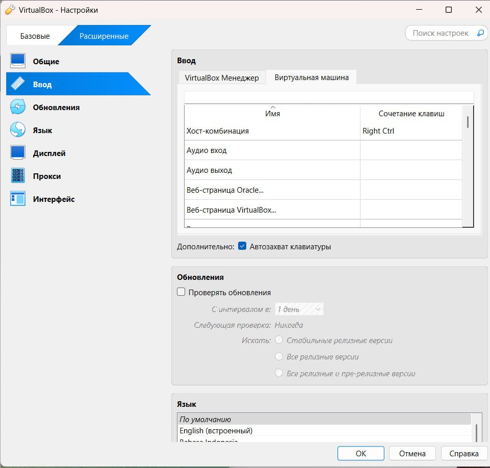
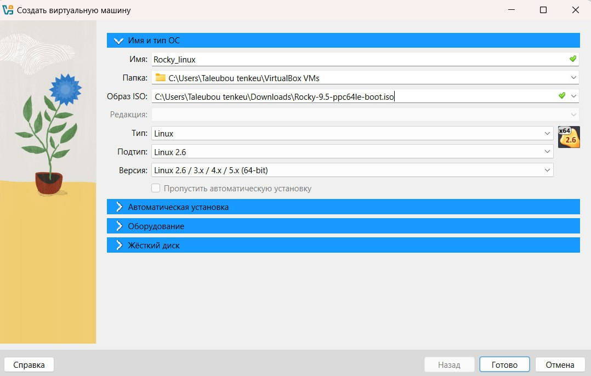
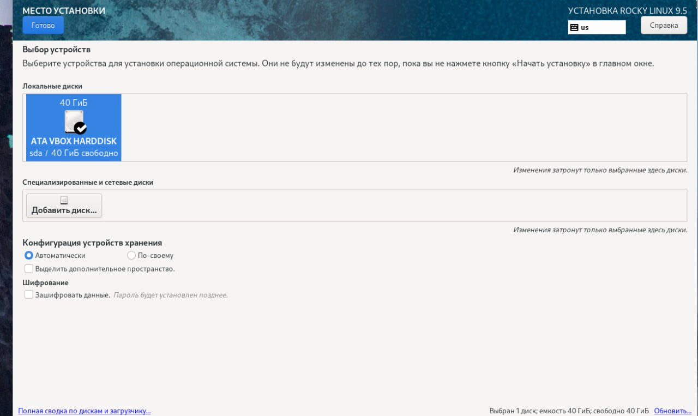
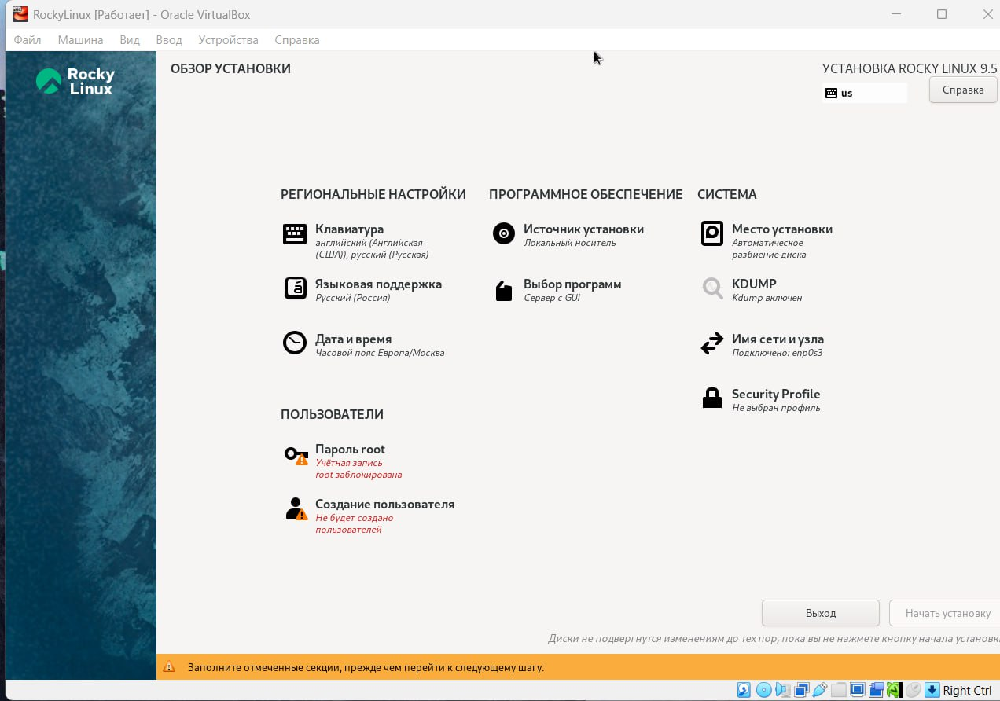
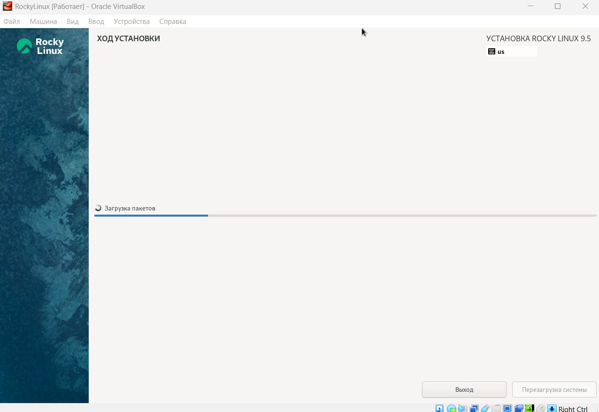
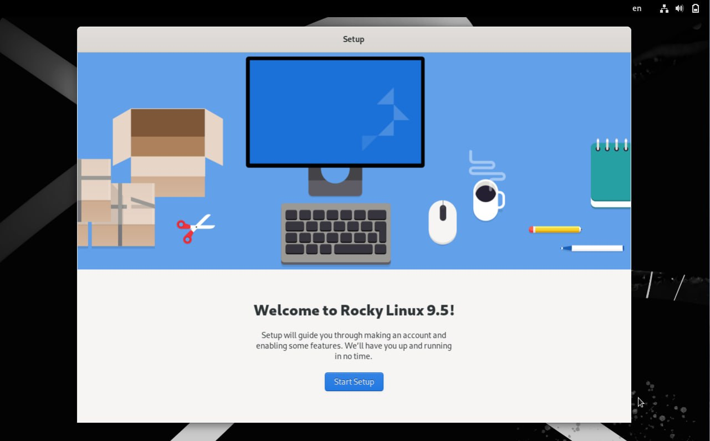
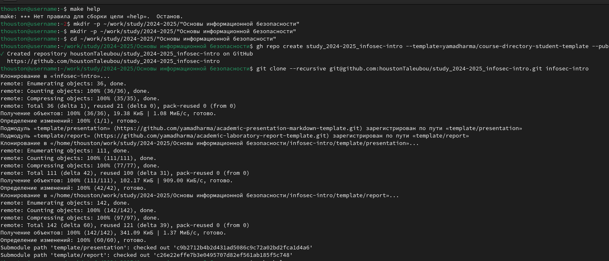
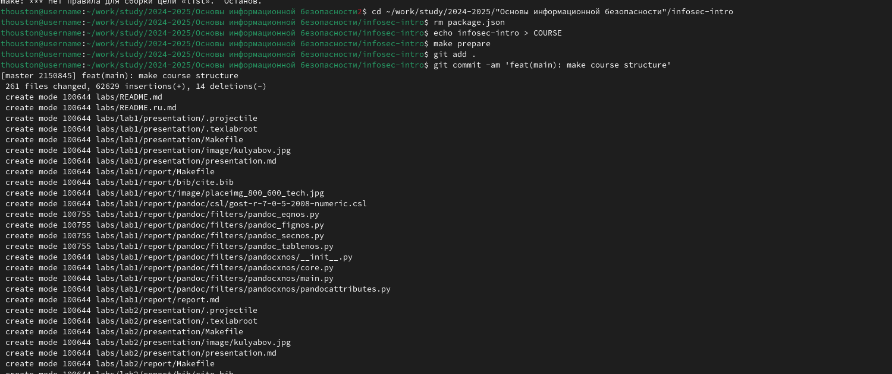

---
## Front matter
lang: ru-RU
title: "Лабораторная работа № 1"
subtitle: "Установка и конфигурация операционной системы на виртуальную машину"
author: |
	 Талебу тенке франк устон{1}

institute: |
	\inst{1}Российский Университет Дружбы Народов

date: 22.02.2025 , Москва, Россия

## Formatting
mainfont: PT Serif
romanfont: PT Serif
sansfont: PT Sans
monofont: PT Mono
toc: false
slide_level: 2
theme: metropolis
header-includes: 
 - \metroset{progressbar=frametitle,sectionpage=progressbar,numbering=fraction}
 - '\makeatletter'
 - '\beamer@ignorenonframefalse'
 - '\makeatother'
aspectratio: 43
section-titles: true

---

## Объект и предмет исследования

- VirtualBox
- Rocky

## Цели 
 - приобретение практических навыков установки операционной системы на виртуальную машину
 - настройки минимально необходимых для дальнейшей работы сервисов.

 Цель лабораторной работы

Целью данной работы является приобретение практических навыков установки операционной системы на виртуальную машину, настройки минимально необходимых для дальнейшей работы сервисов
1-Задаю конфигурацию жёсткого диска
2- Создаю виртуальную машину
3- Задаю конфигурацию жёсткого диска
4- Задаю конфигурацию жёсткого диска
5- Задаю конфигурацию жёсткого диска
6- Добавляю новый привод оптических дисков и выбираю образ 
7- Установка языка
8- Параметры установки
9- Создание пользователя
10- Рабочая система

## Процесс выполнения лабораторной работы 1
{ #fig:001 width=70% height=70% }

## Процесс выполнения лабораторной работы 2
{ #fig:002 width=70% height=70% }

## Процесс выполнения лабораторной работы 3
{ #fig:003 width=70% height=70% }

## Процесс выполнения лабораторной работы 4
{ #fig:004 width=70% height=70% }

## Процесс выполнения лабораторной работы 5
{ #fig:005 width=70% height=70% }

## Процесс выполнения лабораторной работы 6
{ #fig:006 width=70% height=70% }

## Процесс выполнения лабораторной работы 7
{ #fig:007 width=70% height=70% }

## Процесс выполнения лабораторной работы 8
{ #fig:008 width=70% height=70% }

## Вывод

Мы приобрели практические навыки установки операционной системы на виртуальную машину, настройки минимально необходимых для дальнейшей работы сервисов.

