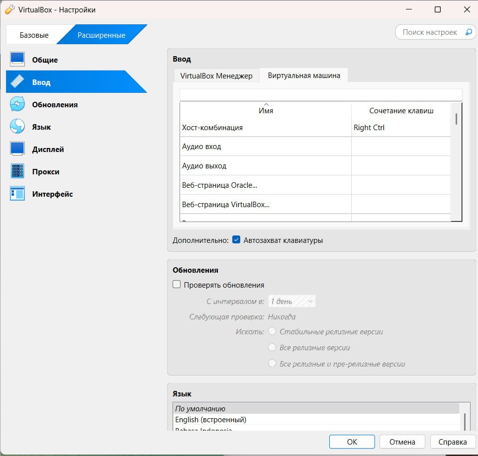
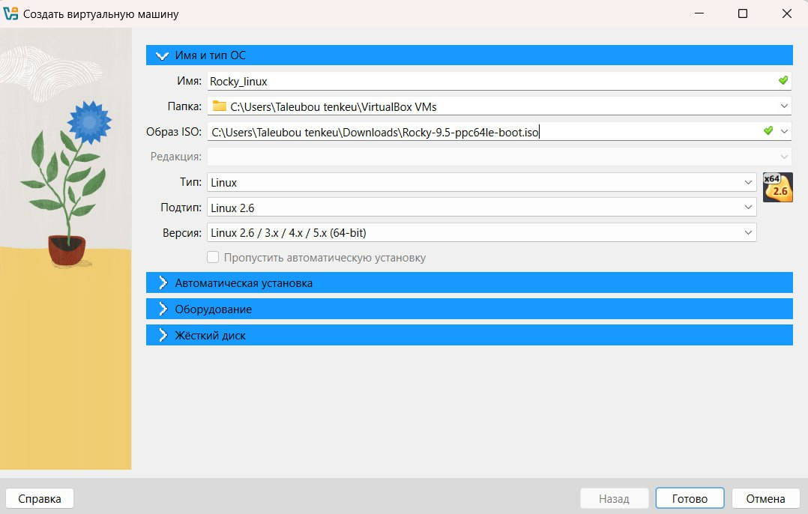
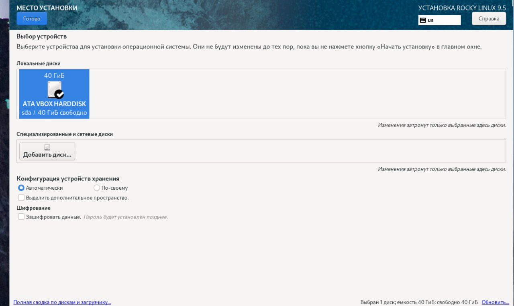
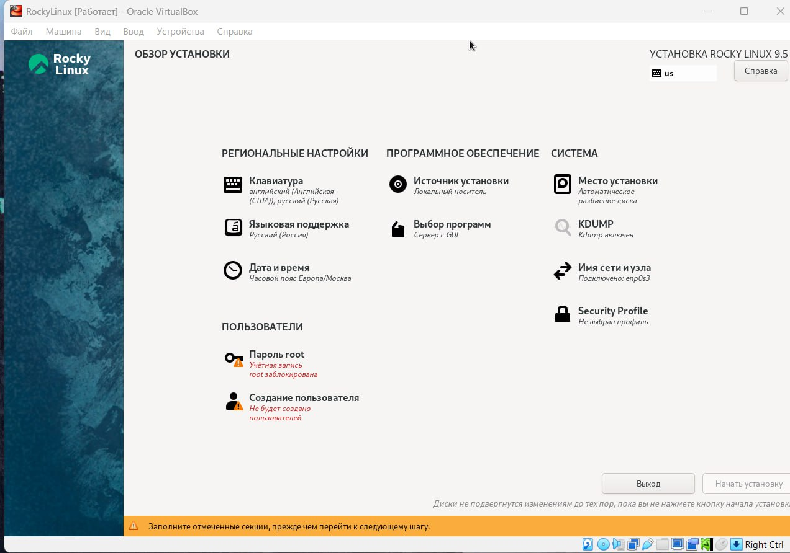
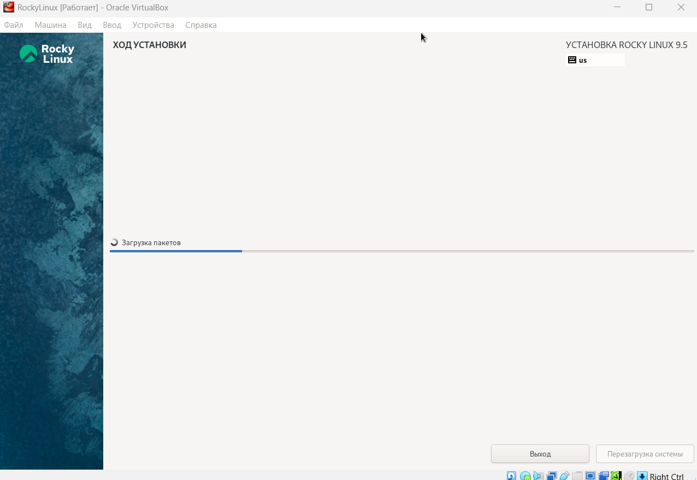
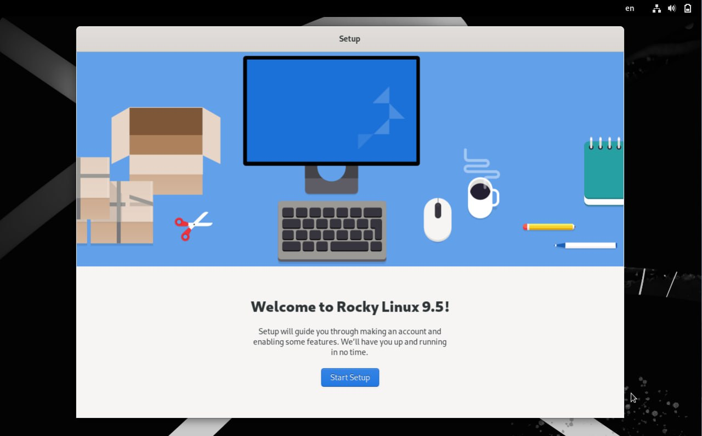
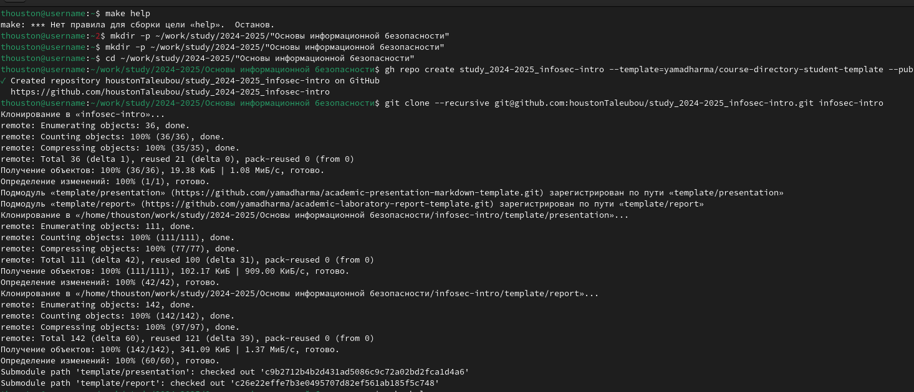
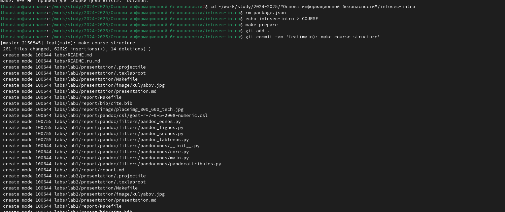

---
## Front matter
title: "Лабораторная работа № 1"
subtitle: "Установка и конфигурация операционной системы на виртуальную машину"
author: "Талебу тенке франк устон НКАбд-04-23"

## Generic otions
lang: ru-RU
toc-title: "Содержание"

## Bibliography
bibliography: bib/cite.bib
csl: pandoc/csl/gost-r-7-0-5-2008-numeric.csl

## Pdf output format
toc: true # Table of contents
toc-depth: 2
lof: true # List of figures
lot: true # List of tables
fontsize: 12pt
linestretch: 1.5
papersize: a4
documentclass: scrreprt
## I18n polyglossia
polyglossia-lang:
  name: russian
  options:
	- spelling=modern
	- babelshorthands=true
polyglossia-otherlangs:
  name: english
## I18n babel
babel-lang: russian
babel-otherlangs: english
## Fonts
mainfont: IBM Plex Serif
romanfont: IBM Plex Serif
sansfont: IBM Plex Sans
monofont: IBM Plex Mono
mathfont: STIX Two Math
mainfontoptions: Ligatures=Common,Ligatures=TeX,Scale=0.94
romanfontoptions: Ligatures=Common,Ligatures=TeX,Scale=0.94
sansfontoptions: Ligatures=Common,Ligatures=TeX,Scale=MatchLowercase,Scale=0.94
monofontoptions: Scale=MatchLowercase,Scale=0.94,FakeStretch=0.9
mathfontoptions:
## Biblatex
biblatex: true
biblio-style: "gost-numeric"
biblatexoptions:
  - parentracker=true
  - backend=biber
  - hyperref=auto
  - language=auto
  - autolang=other*
  - citestyle=gost-numeric
## Pandoc-crossref LaTeX customization
figureTitle: "Рис."
tableTitle: "Таблица"
listingTitle: "Листинг"
lofTitle: "Список иллюстраций"
lotTitle: "Список таблиц"
lolTitle: "Листинги"
## Misc options
indent: true
header-includes:
  - \usepackage{indentfirst}
  - \usepackage{float} # keep figures where there are in the text
  - \floatplacement{figure}{H} # keep figures where there are in the text
---

# Цель работы

Целью данной работы является приобретение практических навыков
установки операционной системы на виртуальную машину, настройки минимально необходимых для дальнейшей работы сервисов.

# Задание
Лабораторная работа подразумевает установку на виртуальную машину
VirtualBox (https://www.virtualbox.org/) операционной системы Linux
(дистрибутив Rocky (https://rockylinux.org/)).
Выполнение работы возможно как в дисплейном классе факультета
физико-математических и естественных наук РУДН, так и дома. Описание
выполнения работы приведено для дисплейного класса со следующими характеристиками:
– Intel Core i3-550 3.2 GHz, 4 GB оперативной памяти, 20 GB свободного
места на жёстком диске;
– ОС Linux Gentoo (http://www.gentoo.ru/);
– VirtualBox верс. 6.1 или старше;
– каталог с образами ОС для работающих в дисплейном классе:
/afs/dk.sci.pfu.edu.ru/common/files/iso/.

# Выполнение лабораторной работы
Создайте новую виртуальную машину.

{#fig:001 width=70%}
{#fig:001 width=70%}
{#fig:001 width=70%}
{#fig:001 width=70%}
{#fig:001 width=70%}
{#fig:001 width=70%}
{#fig:001 width=70%}
{#fig:001 width=70%}

Укажите размер основной памяти виртуальной машины  — 2048
Задайте конфигурацию жёсткого диска — загрузочный,VDI (BirtualBox DiskImage), динамический виртуальный диск
Выберите в VirtualBox для Вашей виртуальной машины Настройки
Носители . Добавьте новый привод оптических дисков и выберите образ
операционной системы, например для работающих в дисплейных классах /afs/dk.sci.pfu.edu.ru/common/files/iso/Rocky-номер_версии.iso

При необходимости скорректируйте часовой пояс, раскладку клавиатуры(рекомендуется добавить русский язык, но в качестве языка по умолчанию указать английский язык; задать комбинацию клавиш для переключения между раскладками клавиатуры — например Alt + Shift ). В разделе выбора программ укажите в качестве базового окружения Server with GUI , а в качестве дополнения — Development Tools. Отключите KDUMP 

# Домашнее задание
Дождитесь загрузки графического окружения и откройте терминал. В окне
терминала проанализируйте последовательность загрузки системы, выполнив команду dmesg. Можно просто просмотреть вывод этой команды: dmesg | grep -i "то, что ищем"

Получите следующую информацию.
1. Версия ядра Linux (Linux version).
2. Частота процессора (Detected Mhz processor).
3. Модель процессора (CPU0).
4. Объем доступной оперативной памяти (Memory available).
5. Тип обнаруженного гипервизора (Hypervisor detected).
6. Тип файловой системы корневого раздела.
7. Последовательность монтирования файловых систем.

# Выводы

Я приобрел практические навыки по установке операционной системы на виртуальную машину, настройке минимально необходимых для дальнейшей работы сервисов.

# Контрольные вопросы
1. **Информация в учетной записи пользователя:**
   - Имя пользователя (username)
   - Домашний каталог (home directory)
   - Идентификатор пользователя (user ID)
   - Идентификатор группы (group ID)
   - Шелл (программа командной оболочки, shell)
   - Права доступа (permissions) к файлам и директориям

2. **Команды терминала:**
   - Для получения справки по команде: `man [команда]` (например, `man ls`)
   - Для перемещения по файловой системе: `cd [путь]` (например, `cd /home/user`)
   - Для просмотра содержимого каталога: `ls` (например, `ls -l` для более подробного списка)
   - Для определения объёма каталога: `du -h [каталог]` (например, `du -h /home/user/documents`)
   - Для создания каталогов / файлов: `mkdir [название]`, `touch [название]` (например, `mkdir new_directory`, `touch new_file.txt`)
   - Для удаления каталогов / файлов: `rm -r [название]` (например, `rm -r old_directory`, `rm file.txt`)
   - Для задания определённых прав: `chmod [права] [файл]` (например, `chmod 755 script.sh`)
   - Для просмотра истории команд: `history`

3. **Файловая система:**
   Файловая система - это метод организации, хранения и управления файлами и данными на устройстве хранения данных (например, жестком диске). Примеры:
   - **FAT32 (File Allocation Table):** Простая и старая файловая система, поддерживаемая многими операционными системами.
   - **NTFS (New Technology File System):** Разработана Microsoft, обеспечивает расширенные функции и безопасность.
   - **EXT4 (Fourth Extended Filesystem):** Распространенная в Linux, поддерживает большие объемы данных и хранит метаданные.

4. **Просмотр подмонтированных файловых систем:**
   Используйте команду `df -h` для отображения информации о подмонтированных файловых системах.

5. **Удаление зависшего процесса:**
   Используйте команду `kill` с номером процесса (PID). Например, `kill -9 PID`, где PID - идентификатор процесса. Если вы не знаете PID, используйте команду `ps` для просмотра активных процессов, а затем примените `kill`.

# Список литературы{.unnumbered}

::: {#refs}
:::
