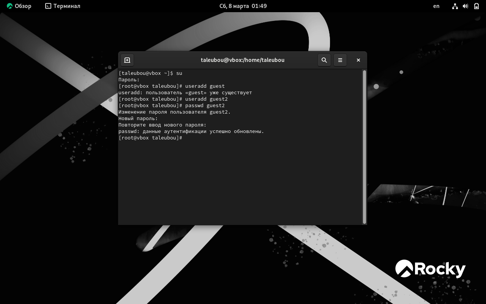
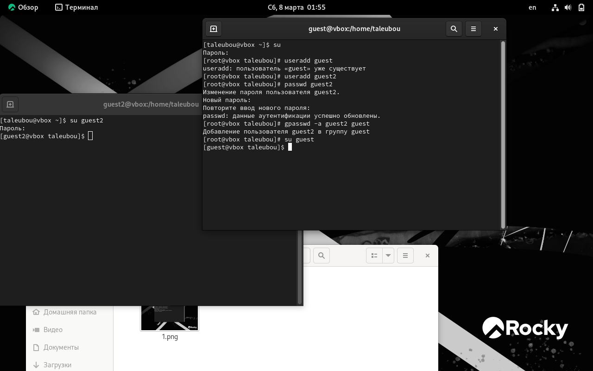
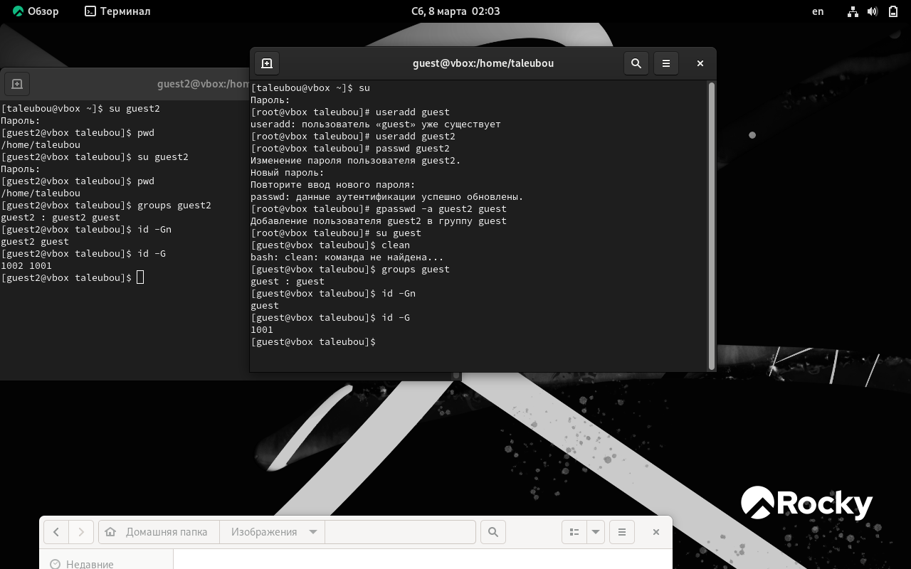
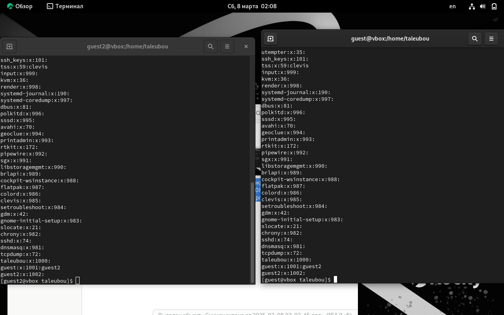
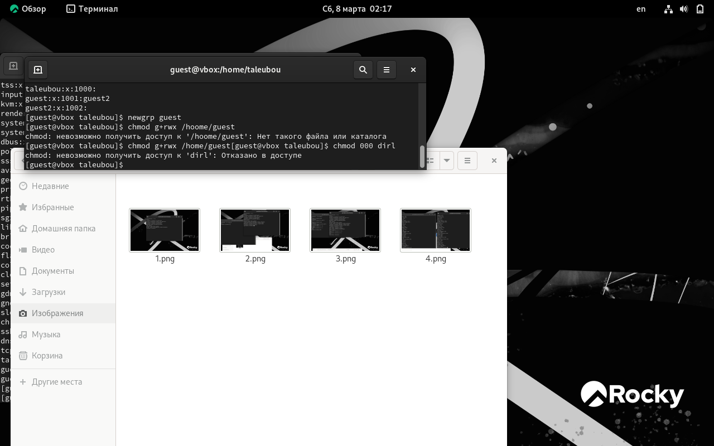
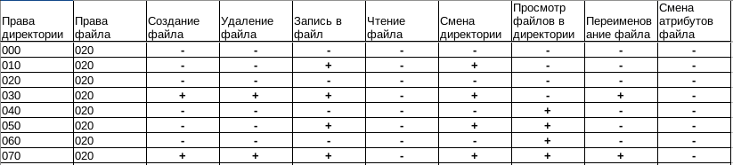
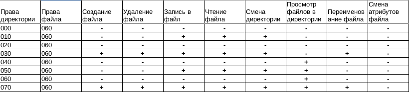

---
## Front matter
lang: ru-RU
title: Дискреционное разграничение прав в Linux. Два пользователя
author: |
	Талебу тенке франк устон , НКАбд-04-23\inst{1}

institute: |
	\inst{1}Российский Университет Дружбы Народов

date: 20 марта 2025, Москва, Россия

## Formatting
mainfont: PT Serif
romanfont: PT Serif
sansfont: PT Sans
monofont: PT Mono
toc: false
slide_level: 2
theme: metropolis
header-includes: 
 - \metroset{progressbar=frametitle,sectionpage=progressbar,numbering=fraction}
 - '\makeatletter'
 - '\beamer@ignorenonframefalse'
 - '\makeatother'
aspectratio: 169
section-titles: true

---
# Информация

:::::::::::::: {.columns align=center}
::: {.column width="70%"}

  * Талебу тенке франк устон 
  * Студент, НКАбд-04-23
  * Российский университет дружбы народов
  * [1032224534@pfur.ru](mailto: 1032224534@pfur.ru)

:::

:::
::::::::::::::

# Цели и задачи работы

## Цель лабораторной работы

Получение практических навыков работы в консоли с атрибутами файлов для групп пользователей.
- Cоздаем учётную запись пользователя guest его пароль.
- И его пароль.
 - Cоздаем учётную запись пользователя guest его пароль.
 gpasswd -a guest2 guest
 - Права директории и права файла
 - Установленные права и разрешенные действия для групп
 - Минимальные права для совершения операций

# Процесс выполнения лабораторной работы

## Процесс выполнения лабораторной работы
{ #fig:001 width=70% height=70% }

##Процесс выполнения лабораторной работы

{ #fig:002 width=70% height=70% }

## Процесс выполнения лабораторной работы

{ #fig:003 width=70% height=70% }

## Процесс выполнения лабораторной работы 

{ #fig:004 width=70% height=70% }

## Процесс выполнения лабораторной работы

{ #fig:005 width=70% height=70% }

## Процесс выполнения лабораторной работы

 { #fig:006 width=70% height=70% }

## Процесс выполнения лабораторной работы

{ #fig:007 width=70% height=70% }

## Процесс выполнения лабораторной работы

{ #fig:008 width=70% height=70% }

## Процесс выполнения лабораторной работы

{ #fig:009 width=70% height=70% }

## Процесс выполнения лабораторной работы

{ #fig:010 width=70% height=70% }

# Выводы по проделанной работе

## Вывод

- в этой лаборатории мы узнали, как получить практические навыки работы в консоли с атрибутами файлов для групп пользователей.

