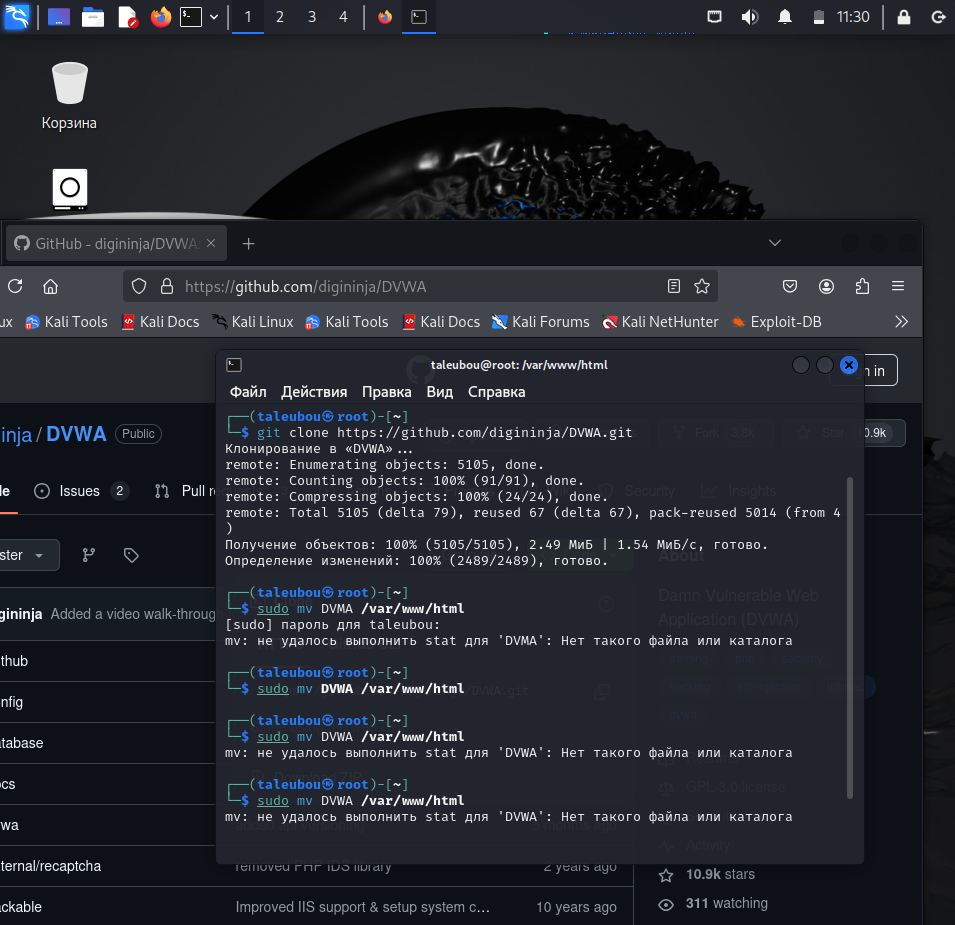
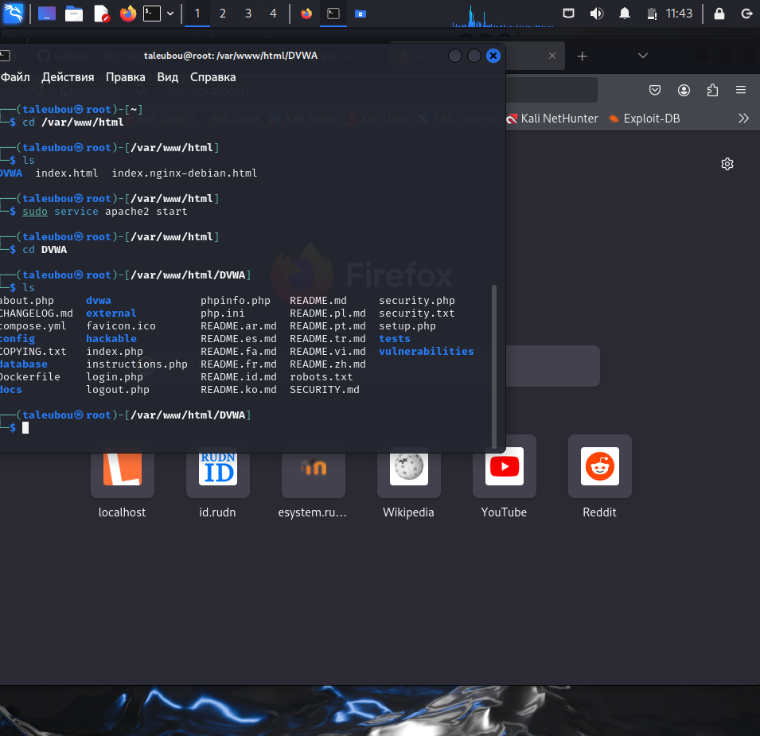
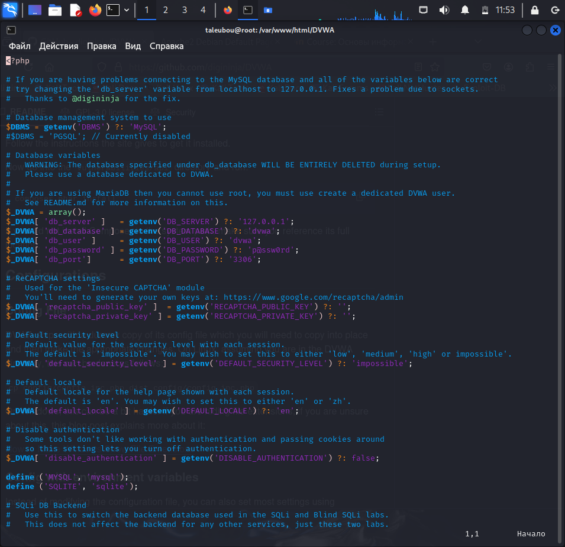
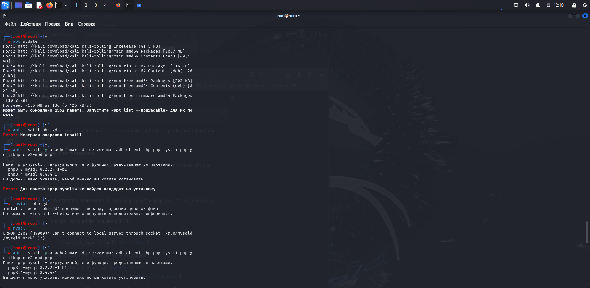
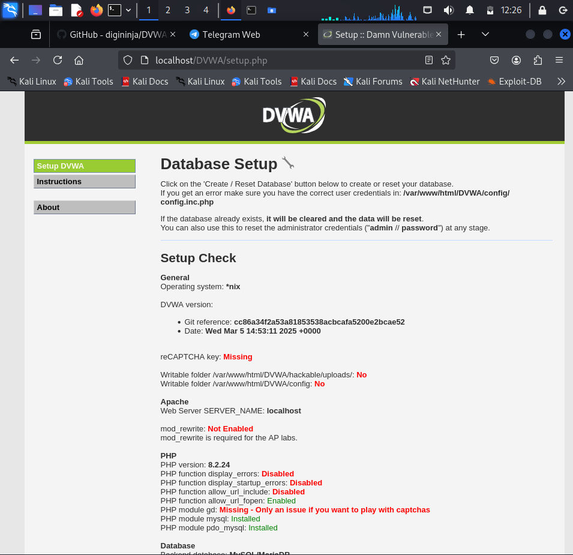

---
## Front matter
lang: ru-RU
title: Отчёт по индивидуальному проекту. Этап 2
author: |
	 Талебу тенке франк устон НКАбд-03-23\inst{1}

institute: |
	\inst{1}Российский Университет Дружбы Народов

date: 19 марта, Москва, Россия

## Formatting
mainfont: PT Serif
romanfont: PT Serif
sansfont: PT Sans
monofont: PT Mono
toc: false
slide_level: 2
theme: metropolis
header-includes: 
 - \metroset{progressbar=frametitle,sectionpage=progressbar,numbering=fraction}
 - '\makeatletter'
 - '\beamer@ignorenonframefalse'
 - '\makeatother'
aspectratio: 169
section-titles: true

---
# Информация

:::::::::::::: {.columns align=center}
::: {.column width="70%"}

  * Талебу тенке франк устон
  * Студент, НКАбд-03-23
  * Российский университет дружбы народов
  * [1032224534@pfur.ru](mailto: 1032224534@pfur.ru)

:::

::::::::::::::

# Цели и задачи работы

## Цель лабораторной работы

Установка DVWA в гостевой системе Kali Linux.

# Процесс выполнения лабораторной работы

## Процесс выполнения лабораторной работы
Клонируем репозиторий git: sudo git clone https://github.com/digininja/DVWA.git.

{#fig:001 width=/70%}

## Процесс выполнения лабораторной работы
Скопируем файл конфигурации и переименуем его: cp config.inc.php.dist config.inc.php. 

{#fig:002 width=50%}

## Процесс выполнения лабораторной работы
Установим mariadb

{#fig:003 width=70%}

## Процесс выполнения лабораторной работы
Запустиv сервер Apache : sudo service apache2 start

{#fig:004 width=70%}

## Процесс выполнения лабораторной работы
Давайте нажмем create, чтобы создать базу данных. Затем введите имя пользователя и пароль

{#fig:005 width=70%}

# Выводы по проделанной работе

## Вывод

В ходе выполнения данной лабораторной работыб, я установила DVWA в гостевой системе Kali Linux.

## Список литературы{.unnumbered}

1. Парасрам, Ш. Kali Linux: Тестирование на проникновение и безопасность : Для профессионалов. Kali Linux / Ш. Парасрам, А. Замм, Т. Хериянто, и др. – Санкт-Петербург : Питер, 2022. – 448 сс..

